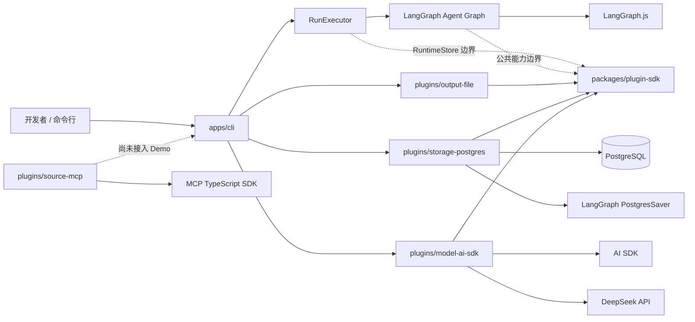
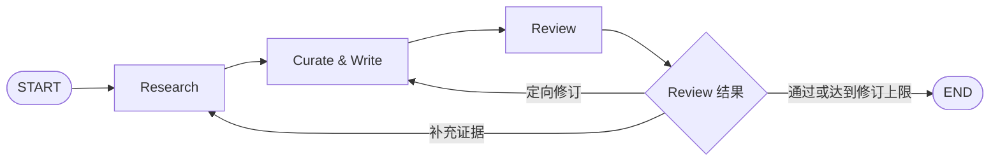
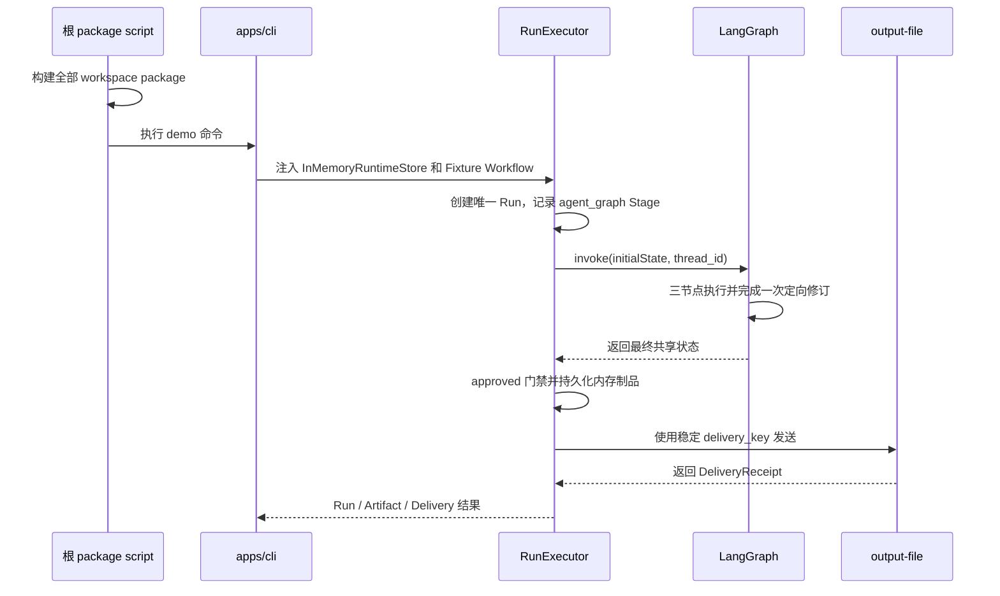

# 当前架构与目录说明

本文说明仓库**当前已经实现**的架构、运行流程，以及各目录和关键文件在工程中的作用。
面向生产环境的完整设计与后续演进方向见
[技术方案](./technical-design.md)。

## 1. 当前阶段

项目目前处于“可恢复运行骨架”阶段，已经具备：

- pnpm monorepo、统一 TypeScript 配置和质量检查命令；
- 基于 LangGraph.js 的三节点 Agent Graph；
- 框架无关的插件公共契约；
- 确定性 `RunExecutor`、Run/Stage 状态机、发布门禁和审计接口；
- PostgreSQL Runtime Store、版本化迁移、运行锁和 LangGraph durable checkpoint；
- DeepSeek AI SDK 结构化模型适配、版本化编辑/审核 Prompt 和确定性引用渲染；
- 本地文件输出和 MCP Client 适配器骨架；
- 完全离线、无需模型密钥和外部服务的 Fixture Demo；
- PostgreSQL + pgvector 的本地基础设施配置。

目前已经能使用真实 DeepSeek 模型处理合成回放证据，但尚未接入实时新闻来源、MCP Gateway
和长期记忆。当前代码已经验证**模块边界、结构化模型链路、持久化执行闭环和故障恢复**，
但还不是可直接用于生产的实时新闻研究系统。

## 2. 总体架构

当前实现采用“CLI 负责组装、Core 负责编排、Plugin SDK 定义边界、Plugins
连接外部能力”的分层方式。



各层职责如下：

| 层级                  | 当前职责                                         | 不负责的内容                                 |
| --------------------- | ------------------------------------------------ | -------------------------------------------- |
| `apps/cli`            | 命令解析、依赖组装、迁移、Fixture Run 和审计查询 | Agent 图的结构、通用插件协议                 |
| `packages/core`       | Agent 图、确定性 Runtime、恢复、发布门禁         | 具体模型厂商、MCP 传输、数据库驱动、输出渠道 |
| `packages/plugin-sdk` | 定义稳定、框架无关的外部能力接口和数据契约       | 任何第三方 SDK 的具体实现                    |
| `plugins/*`           | 将第三方 SDK 或本地能力适配到项目边界            | 决定业务流程和 Agent 节点顺序                |
| `presets` / `prompts` | 预留业务主题、角色指令、栏目和评测配置           | 通用运行时能力                               |
| `db` / `compose.yaml` | PostgreSQL 环境和版本化业务迁移                  | Agent 语义决策                               |

### 2.1 依赖方向

工程希望保持以下单向依赖：

```text
apps  ──────>  core  ──────>  plugin-sdk
  └────────────────────────>  plugins  ──────>  plugin-sdk / 第三方 SDK
```

关键约束：

- LangGraph 编排代码和类型只留在 `packages/core` 内，不进入 Plugin SDK；根包仅为 Studio 本地开发声明必要的运行时依赖；
- AI SDK、MCP SDK 和 PostgreSQL Driver 只出现在对应插件中；
- CLI 是当前的 Composition Root，负责选择并组装 Core 与插件；
- 插件不能决定 Agent 工作流，也不应依赖 Core 的内部实现；
- Core 和公共契约不绑定“金融 + AI”主题，领域配置最终应放入 Preset 和 Prompt。

当前 `storage-postgres` 已实现 Plugin SDK 的 `RuntimeStore` 和 Model Call Ledger；`source-mcp`
已实现 Streamable HTTP 连接、工具白名单、JSON Schema 参数校验、超时和结果大小限制。
长期记忆的 `MemoryPort` 仍无实现。

## 3. Agent Graph

`packages/core` 使用 LangGraph.js `StateGraph` 表达三个 AI 节点、补证分支和受限的修订循环。



节点在当前 Demo 中的作用：

| 节点           | 输入关注点         | 输出到共享状态                        | 当前实现                             |
| -------------- | ------------------ | ------------------------------------- | ------------------------------------ |
| Research       | 研究主题、审核反馈 | `plan`、`evidence`、`modelUsage`      | Fixture、回放或 MCP Function Calling |
| Curate & Write | 证据、Review 反馈  | `stories`、`draft`、`revisionCount`   | Fixture，或 DeepSeek 结构化 Story    |
| Review         | 草稿与证据         | `approved`、`critique`、`reviewRoute` | Fixture，或 DeepSeek 结构化审核决定  |

Review 的条件分支规则是：

1. `approved === true` 时结束；
2. `revisionCount >= maxRevisions` 时也结束；
3. `reviewRoute === "research"` 时回到 Research 补充证据；
4. 否则回到 Curate & Write 定向修订。

因此，达到修订上限只表示流程停止继续修改，**不一定表示草稿已经通过**。调用方应继续读取
`approved` 判断最终质量状态。

当前 Fixture 因已有两条证据，会触发 Curate & Write 修订路线；Research 补证路线由单元测试
覆盖，真实模型接入后由 Review 的结构化输出决定。

## 4. 共享状态

所有节点通过 `AgentGraphState` 读写同一份结构化状态。

| 字段            | 作用                                               | 主要写入者     |
| --------------- | -------------------------------------------------- | -------------- |
| `runId`         | 一次运行的唯一标识，同时作为 LangGraph `thread_id` | CLI            |
| `topic`         | 本次研究主题                                       | CLI            |
| `maxRevisions`  | Review 拒绝后允许的最大修订次数                    | CLI            |
| `plan`          | 研究步骤                                           | Research       |
| `evidence`      | 带标题、URL 和摘录的证据                           | Research       |
| `stories`       | 聚合后的事件及其证据引用                           | Curate & Write |
| `draft`         | Markdown 简报草稿                                  | Curate & Write |
| `critique`      | 质量检查结论                                       | Review         |
| `approved`      | 当前草稿是否通过                                   | Review         |
| `reviewRoute`   | 未通过时选择 `research` 或 `revise`                | Review         |
| `revisionCount` | 已执行的修订次数                                   | Curate & Write |
| `modelUsage`    | 模型请求数和累计 Token；通过 reducer 相加          | 模型节点       |
| `trace`         | 节点执行轨迹；通过 reducer 追加而不是覆盖          | 所有节点       |

状态字段使用 Zod 描述，既提供 TypeScript 类型推导，也在图运行时约束状态形状。
除 `runId` 和 `topic` 外，其余字段都定义了默认值。

默认使用 LangGraph `MemorySaver`，适合 Demo 和单元测试；传入 `{ checkpointer: false }`
可以关闭检查点，传入 PostgreSQL `PostgresSaver` 则支持进程重启后的节点级恢复。

LangGraph checkpoint 与产品 Runtime 状态用途不同：前者记录图执行到哪个节点，后者通过
`runs`、`run_stages`、`model_calls`、`artifacts` 和 `deliveries` 记录逻辑任务、模型成本、技术重试、
不可变制品和外部副作用。

## 5. Demo 端到端流程

执行 `pnpm demo` 时，实际调用链如下：



默认产物是根目录下的 `.artifacts/demo-digest.md`。可以通过 `AGENT_OUTPUT_PATH`
覆盖输出路径。该流程不会读取 `.env.example` 中的数据库配置，也不会调用模型、MCP
或外部网络。

`pnpm run:fixture` 使用同一套 Runtime，但注入 `PostgresRuntimeStore` 和 `PostgresSaver`；它支持
重复触发复用、失败恢复以及 `status <run-id>` 审计查询。

`pnpm run:ai` 进一步注入官方 DeepSeek Provider、严格结构化的 Curate/Review Handler 和合成回放
Evidence。模型只返回 Story 与审核业务字段；Evidence URL 不在模型输出 Schema 中，最终 Markdown
链接由 Core 使用原始 Evidence 确定性生成。该命令用于 P2 模型链路验收，不代表实时新闻采集。
Provider HTTP 自动重试被关闭，Schema 恢复调用显式计入 `modelUsage` 和 PostgreSQL
`model_calls`。每次请求在发送前预留预算；即使进程在 checkpoint 前中断，预留记录也会继续占用
Run 的硬请求上限。

`pnpm run:live` 在此基础上组装 `ToolCallingModelProvider`、受控 `McpGateway` 和 Tool Calling
Research Provider。模型产生工具意图，Gateway 执行白名单工具；Evidence 直接从 MCP 结构化结果
解析并校验，模型不能生成或替换来源 URL。

## 6. Plugin SDK

`packages/plugin-sdk` 是 Core 与外部实现之间的稳定协议层，公共类型不暴露第三方框架类型。

| 契约                       | 用途                                                        | 当前实现情况                                      |
| -------------------------- | ----------------------------------------------------------- | ------------------------------------------------- |
| `PluginManifest`           | 描述插件 ID、名称、版本、类型和 Core 兼容范围               | Model 与 File Output 已提供 Manifest              |
| `ModelProvider`            | 接收角色、系统提示和用户提示，返回文本、模型名和 token 用量 | `model-ai-sdk` 已适配 `generateText`              |
| `StructuredModelProvider`  | 使用 Zod Schema 约束 JSON 业务输出                          | DeepSeek + AI SDK `Output.object` 已接入 `run-ai` |
| `ToolCallingModelProvider` | 返回函数调用意图但不在 Provider 内执行工具                  | DeepSeek + AI SDK 已实现并通过协议测试            |
| `McpGateway`               | 列出允许的工具并执行结构化工具调用                          | `source-mcp` 已实现受控 Streamable HTTP Gateway   |
| `MemoryPort`               | 搜索记忆和提交记忆候选                                      | 已定义接口；暂无实现                              |
| `OutputPlugin`             | 按稳定 `deliveryKey` 幂等发送并返回回执                     | `output-file` 已实现并通过幂等契约测试            |
| `RuntimeStore`             | 持久化 Run、Stage、Artifact、Delivery 和运行锁              | PostgreSQL 与内存实现均已接入                     |

`PluginKindSchema` 预留了 `model`、`embedding`、`source`、`storage` 和 `output`
五类插件，但当前还没有为每一类都提供完整接口和实现。

## 7. 目录结构与作用

```text
.
├── apps/
│   └── cli/                      # 命令行入口与当前 Composition Root
├── packages/
│   ├── core/                     # Agent Graph 与确定性 Runtime
│   └── plugin-sdk/               # 框架无关的公共插件契约
├── plugins/
│   ├── model-ai-sdk/             # AI SDK -> ModelProvider 适配器
│   ├── output-file/              # Markdown/文本制品写入本地文件
│   ├── source-mcp/               # MCP Client、传输与受控 Gateway
│   └── storage-postgres/         # Runtime Store、迁移和 durable checkpoint
├── db/
│   ├── init/                     # 数据库容器首次启动时执行的初始化 SQL
│   └── migrations/               # 可重复部署的版本化业务迁移
├── docs/                         # 当前架构与目标技术方案
├── presets/
│   └── finance-ai/               # 金融与 AI 领域 Preset 占位
├── prompts/                      # 版本化 Agent Prompt 的预留位置
├── .env.example                  # 本地环境变量示例
├── compose.yaml                  # PostgreSQL + pgvector 本地服务
├── package.json                  # 根脚本、工具链版本与 Node/pnpm 约束
├── pnpm-workspace.yaml           # monorepo package 发现与依赖安装策略
├── tsconfig.base.json            # 所有 package 共用的严格 TS 编译配置
└── eslint.config.mjs             # 全仓库 ESLint 规则
```

### 7.1 `apps/cli`

- `src/index.ts`：解析 `demo`、`migrate`、`run`、`run-ai`、`run-live` 和 `status` 命令；
- `src/demo.ts`：组装内存 Runtime、运行 Agent Graph 并输出 Markdown；
- `src/runtime-command.ts`：组装 PostgreSQL Runtime、迁移、持久化执行和审计查询；
- `src/ai-runtime-command.ts`：安全读取 DeepSeek 配置并组装结构化模型回放 Run；
- `src/live-runtime-command.ts`：组装 DeepSeek Function Calling、MCP Gateway 和实时研究 Run；
- `src/replay-research.ts`：提供明确标注为合成数据的固定 Evidence；
- `src/fixture-handlers.ts`：定义 Research、Curate & Write、Review 三个离线 Fixture Handler；
- `src/studio-graph.ts`：导出供 LangGraph Studio 加载的无本地 checkpointer Graph；
- `package.json`：声明 CLI 二进制名和对 Core、Plugin SDK、File Output 的依赖。

未来真实 Handler、配置加载和插件选择也从这一层注入，避免把部署细节放进 Core。

### 7.2 `packages/core`

- `src/agent-state.ts`：定义 Evidence、Story 和 Agent Graph 的共享状态；
- `src/agent-graph.ts`：定义三节点顺序、Review 条件分支、修订上限和检查点策略；
- `src/agent-workflow.ts`：封装 LangGraph 首次执行与 checkpoint 恢复；
- `src/run-executor.ts`：负责 Run 幂等、Stage 恢复、发布门禁、制品和发送；
- `src/in-memory-runtime-store.ts`：为 Demo 和离线测试提供 RuntimeStore；
- `src/model-node-output.ts`：定义严格的 Research、Curate 和 Review 输出 Schema；
- `src/model-agent-handlers.ts`：实现结构化模型节点、预算、引用校验和确定性 Markdown；
- `src/tool-calling-research.ts`：实现受控工具循环和结构化 Evidence 采集；
- `src/finance-ai-prompts.ts`：当前 P2 使用的版本化 Curate/Review Prompt；
- `src/index.ts`：Core 的公开导出面，调用方不需要引用内部文件；
- `src/agent-graph.test.ts`：验证定向修订、Research 补证、预算耗尽和执行轨迹。

Core 是当前最主要的业务运行模块，但节点的具体行为通过 `AgentNodeHandlers` 注入，因此图结构
与 Fixture/模型实现可以独立变化。

### 7.3 `packages/plugin-sdk`

- `src/index.ts`：集中定义插件 Manifest、模型、MCP、记忆和输出接口；
- 只依赖 Zod，不依赖 LangGraph、AI SDK、MCP SDK 或数据库驱动；
- 是第三方插件未来应该依赖的公共 package。

### 7.4 `plugins`

- `model-ai-sdk`：把 AI SDK 的 `LanguageModel` 包装成项目 `ModelProvider`，并使用官方
  DeepSeek Provider 实现 `StructuredModelProvider`；
- `output-file`：确保目标目录存在后写入 UTF-8 文件，是当前唯一接入执行闭环的插件；
- `source-mcp`：创建官方 MCP SDK `Client`，提供 Streamable HTTP 连接、显式工具白名单、JSON
  Schema 参数校验、超时与响应体限制；
- `storage-postgres`：提供 `PostgresRuntimeStore`、Model Call Ledger、session advisory lock、带
  checksum 的迁移 runner 和 LangGraph `PostgresSaver`；长期记忆的 `MemoryPort` 尚未实现。

### 7.5 `db` 与 `compose.yaml`

`compose.yaml` 提供 PostgreSQL 17 + pgvector 容器，默认数据库为
`finance_ai_news`。`db/init/001_extensions.sql` 在数据库首次初始化时启用 `vector`
扩展。

`db/migrations` 当前创建 `runs`、`run_stages`、`model_calls`、`artifacts` 和 `deliveries`。迁移 runner 使用
全局 advisory lock、checksum 和逐文件事务；它与只在数据卷首次创建时执行的 `db/init` 分离。
离线 `pnpm demo` 不需要数据库，持久化 `pnpm run:fixture` 和 `pnpm run:ai` 需要先执行
`pnpm db:migrate`。

### 7.6 `presets` 与 `prompts`

- `presets/finance-ai`：未来承载主题分类、栏目、来源建议和完整回放评测；
- 当前可执行的 P2 Prompt 以版本化 TypeScript 常量放在 Core，避免构建时丢失 Markdown 资源；
- Preset 成为独立 workspace package 后，再把金融领域 Prompt 从 Core 移出。

将领域内容放在这两个目录，可以让 Core 保持通用的信息研究能力，而不是把金融与 AI
规则硬编码进工作流。

### 7.7 根目录工程文件

| 文件                  | 作用                                                                        |
| --------------------- | --------------------------------------------------------------------------- |
| `package.json`        | 统一 build、typecheck、lint、format、test、demo 和完整 `check` 命令         |
| `pnpm-workspace.yaml` | 将 `apps/*`、`packages/*`、`plugins/*` 纳入 workspace                       |
| `tsconfig.base.json`  | 启用 NodeNext、严格类型、声明文件和 source map                              |
| `eslint.config.mjs`   | 统一 TS Lint，并禁止显式 `any`、要求 type-only import                       |
| `.env.example`        | 记录数据库、时区和制品目录的计划配置；Demo 仅使用可选的 `AGENT_OUTPUT_PATH` |
| `CONTRIBUTING.md`     | 本地开发、设计约束和 PR 要求                                                |
| `SECURITY.md`         | 安全问题报告方式                                                            |
| `LICENSE`             | Apache-2.0 许可证                                                           |

构建产物位于各 package 的 `dist/`，运行制品位于 `.artifacts/`。两者都不是源代码目录，
不应作为架构扩展点。

## 8. 当前完成度与目标架构的差距

| 能力                 | 当前状态                         | 下一步接线位置                            |
| -------------------- | -------------------------------- | ----------------------------------------- |
| 三节点编排与有限修订 | 已实现                           | 接入真实 `ModelProvider` Handler          |
| 离线研究闭环         | 已实现                           | `apps/cli/src/demo.ts`                    |
| 本地文件输出         | 已实现                           | `plugins/output-file`                     |
| 真实模型调用         | DeepSeek 已组装并完成冒烟验收    | 增加评测基线与更多模型 Provider           |
| MCP 新闻采集         | Gateway 与 `run-live` 已完成     | 配置并验收实际金融/AI MCP 新闻源          |
| PostgreSQL Runtime   | 已实现 Run/Stage、迁移、锁和恢复 | 后续扩展内容与长期记忆表                  |
| 长期记忆             | 只有公共接口                     | `MemoryPort` 与确定性 Memory Service 实现 |
| 业务 Prompt/Preset   | 目录占位                         | `prompts/`、`presets/finance-ai/`         |
| 运行幂等、审计、恢复 | 已实现并接入 CLI                 | 补真实 PostgreSQL 并发集成测试与可观测性  |
| 飞书输出、评测与观测 | 未实现                           | 新插件和独立 eval/observability 模块      |

在继续开发时，应优先保持现有边界：Core 只表达流程与领域状态，第三方能力通过 Plugin SDK
接入，CLI/Runtime 负责组装，Preset 和 Prompt 负责领域差异。

### 8.1 节点与逻辑职责

当前三个 Handler 已与 MVP 运行边界一致，但内部仍保留六种逻辑职责作为 Prompt、Schema 和
评测标签：Research 合并 Planner 与 Researcher，Curate & Write 合并 Curator 与 Editor，
Review 承担 Critic；Memory Curator 不作为首期 AI 节点。

采集执行、标准化、精确去重、Schema 校验、持久化、发送和幂等继续由确定性代码负责。只有回放评测、
上下文限制、权限差异、预算或恢复边界证明有必要时，才把逻辑职责重新拆成更多 AI 节点。完整决策见
[技术方案](./technical-design.md#52-agent-runtimeai-节点与职责)。
