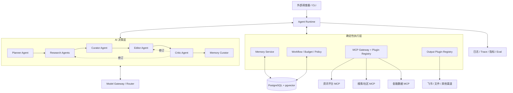
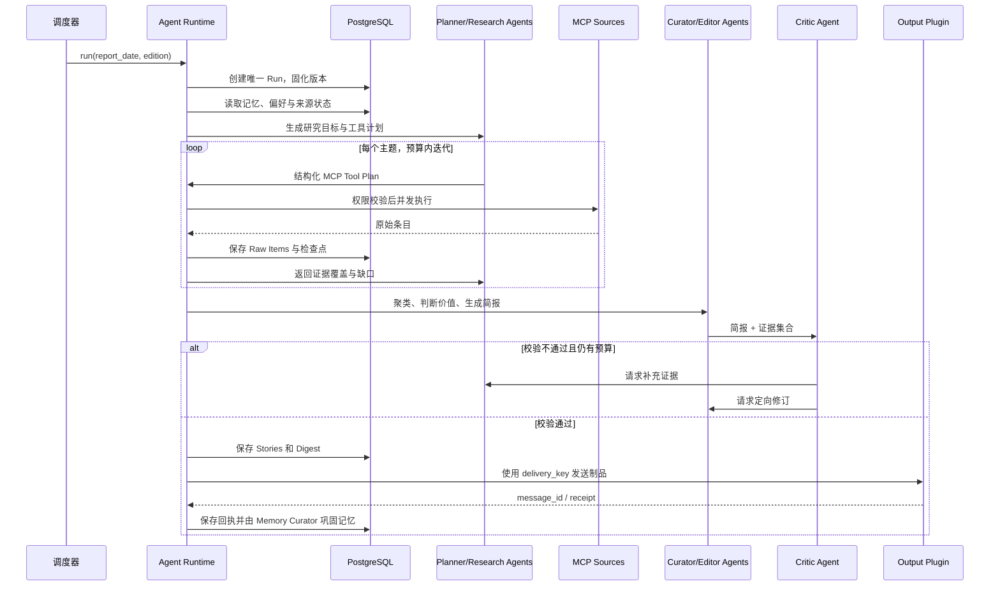
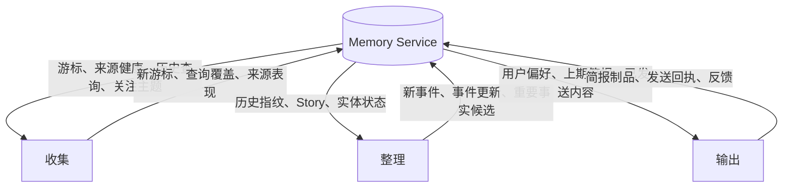

# Finance & AI News Agent 技术方案

> 状态：Draft v2
>
> 目标：以 AI-first 和开源优先的方式，每天自动从多个平台收集金融与 AI 信息，完成整理、生成简报和发送；记忆能力贯穿收集、整理、输出全过程。

## 0. 产品与工程原则

### 0.1 AI-first

AI 不是流水线末端的摘要组件，而是产品的语义决策核心：

- 面对非结构化信息、开放问题和策略选择时，默认先设计 Agent 能力和评测集，而不是堆叠硬编码规则；
- Planner Agent 决定今天研究什么，Research Agent 决定如何补充证据，Curator Agent 判断事件关系与价值，Editor Agent 组织表达，Critic Agent 校验质量，Memory Curator 决定沉淀什么；
- Prompt、上下文工程、模型路由、工具描述、记忆策略和评测数据都是一等代码资产；
- 优先通过模型能力、反馈和评测改进效果，确定性规则只处理安全边界、协议转换、数据完整性、成本预算和外部副作用；
- 任何 AI 结论都必须携带证据、置信度和生成版本，AI-first 不等于不可控。

各职责的默认归属：

| 问题类型                                     | 默认负责人              |
| -------------------------------------------- | ----------------------- |
| 研究方向、查询扩展、语义理解、价值判断、写作 | Agent                   |
| MCP 协议、权限、Schema、超时、幂等、事务     | 确定性运行时            |
| 事实一致性、引用完整性、发布质量             | Critic Agent + 程序校验 |
| 模型或 Prompt 是否变好                       | 离线评测 + 线上反馈     |

### 0.2 开源优先

开源是架构约束，而不是发布前的包装工作：

- Core、Agent Runtime、Memory、CLI 和 Plugin SDK 均以开放源码交付，不依赖私有控制平面才能运行；
- 支持自行托管，默认 Docker Compose 即可启动，遥测默认关闭；
- LLM、Embedding、MCP 来源、存储和输出渠道全部通过公开 Port 或 Plugin 接口替换；
- 核心流程不绑定某一家模型、云、数据库托管服务或消息平台；
- Core 保持领域中立，“金融 + AI”以官方 `finance-ai` Preset 提供主题、角色指令、来源建议、栏目和评测集；
- 仓库内提供示例插件、模拟 MCP Server、脱敏 Fixture 和离线回放，让贡献者无需商业账号即可开发；
- 公共接口使用语义化版本，插件兼容性通过契约测试保证；
- 许可证、依赖许可证审计、贡献指南、安全策略和发布流程从 Phase 0 建立。

首选采用 Apache-2.0 许可证，允许个人和企业使用、修改和分发，并提供明确的专利授权。正式发布前仍需完成依赖许可证扫描和项目方确认。

## 1. 方案摘要

本产品采用“AI Agent 决策内核 + 确定性执行外壳”的架构：

- 由多个角色化 Agent 完成研究规划、信息研究、事件整理、编辑、校验和记忆巩固；
- Agent 可在阶段内进行受预算约束的规划、工具选择和修订循环；
- 确定性运行时负责阶段边界、状态持久化、重试、幂等、权限和审计；
- MCP 连接器负责访问外部平台，但只允许调用配置白名单内的工具；
- Model Gateway 支持不同商业或本地模型，并按 Agent 角色选择模型；
- PostgreSQL 是事实与运行状态的主存储，`pgvector` 支持跨日相似检索；
- 记忆不是独立的尾部步骤，而是一个横跨收集、整理、输出的能力平面；
- 简报先持久化为不可变制品，再调用 Output Plugin 发送，飞书只是首个官方插件；
- 所有核心能力均可在本地运行和替换，方便社区扩展新的模型、来源和输出渠道。

MVP 推荐技术栈：

- 语言与运行时：TypeScript、Node.js；
- 包管理：pnpm；
- Agent 编排：LangGraph.js，仅用于 `packages/core` 内部的角色图、分支和 checkpoint；
- 数据 Schema：Zod；
- MCP：官方 TypeScript SDK，支持 `stdio` 与 Streamable HTTP 两种传输；
- 数据库：PostgreSQL + `pgvector`；
- 模型：通过 `ModelProvider` 和 `ModelRouter` 封装，底层可使用 AI SDK；至少提供一个云模型示例和一个 OpenAI-compatible 本地模型示例；
- 调度：云定时任务或系统 cron 触发 CLI；不在应用进程内维护定时器；
- 部署：一个 Agent Worker 容器 + PostgreSQL，MCP Server 按平台独立部署或由 Worker 拉起；
- 可观测性：结构化日志、OpenTelemetry Trace、基础指标与运行审计表。

首期不引入 Kafka、Redis、Temporal 或分布式多 Agent 基础设施。多个 Agent 是同一 Runtime 内的角色化节点，不要求独立进程。每天一次的任务量不足以抵消分布式组件的维护成本。若后续演进为高频、多租户或大量长任务，再将当前持久化工作流替换为专业工作流引擎。

MCP SDK 处于持续演进中，实现时应锁定经过验证的依赖版本，升级前运行全部连接器契约测试，不能在生产构建中自动漂移到最新版本。

## 2. 需求与边界

### 2.1 核心目标

1. 每天在配置的时区和时间触发一次。
2. 通过多个平台的 MCP 工具获取金融市场和 AI 领域信息。
3. 对原始信息做标准化、过滤、去重、聚类、排序和摘要。
4. 生成有来源、有优先级、可快速阅读的每日简报。
5. 通过飞书 MCP 发送简报，并记录发送结果。
6. 使用历史信息改善下一次收集、判断新旧事件、续写事件进展并适配用户偏好。
7. 任意一次运行都可查询、审计、重试和手动重放。
8. 可替换模型、MCP 来源、存储和输出渠道，不因默认实现产生供应商锁定。
9. 社区贡献者可以完全在本地使用模拟数据运行、测试和开发插件。

### 2.2 非目标

MVP 暂不包含：

- 实时资讯推送；
- 自动交易、投资建议或交易执行；
- 允许 LLM 自由发现并调用任意 MCP 工具；
- 完整 Web 管理后台；
- 多租户计费和复杂权限系统；
- 自动学习后直接修改线上策略或 Prompt。
- 依赖项目官方托管服务才能使用的 SaaS 控制平面。

### 2.3 默认产品约定

- 默认时区为 `Asia/Shanghai`，具体发送时间由配置确定；
- 一天的一期简报由 `(tenant_id, report_date, edition)` 唯一标识；
- 原始内容可能包含提示注入或错误信息，统一按“不可信数据”处理；
- 摘要中的事实必须能追溯到本次采集条目或带来源的历史记忆；
- 金融内容只做资讯整理，不生成个性化投资建议。
- 默认发行版包含 CLI、本地文件输出和飞书输出插件，其他平台由官方或社区插件扩展。

## 3. 总体架构



系统分为两个互补层：

- AI 决策层负责语义工作，并允许在单阶段内按预算进行“计划 → 研究 → 校验 → 修订”；
- 确定性执行层负责让 Agent 的每一步可授权、可持久化、可重放、可计费和可终止。

外部副作用集中在两个边界：

- 收集边界：只读 MCP 调用；
- 输出边界：Output Plugin 发送。

中间整理流程全部以数据库中的不可变输入运行。任一 Agent 节点都可以使用 Fixture 离线重放，这是效果评测和开源贡献的共同基础。

## 4. 每日运行流程



### 4.1 阶段定义

| 阶段          | 输入                           | 输出                                  | 是否允许外部副作用 |
| ------------- | ------------------------------ | ------------------------------------- | ------------------ |
| `PREPARE`     | 运行日期、版本化配置、历史记忆 | Run、配置快照、Agent 研究计划         | 否                 |
| `COLLECT`     | Agent 工具计划、来源游标       | 原始条目、证据覆盖、来源执行记录      | 只读 MCP           |
| `NORMALIZE`   | 原始条目                       | 标准化条目、实体、指纹                | 否                 |
| `ORGANIZE`    | 标准化条目、历史记忆           | Agent 事件簇、价值判断、入选条目      | 否                 |
| `COMPOSE`     | 入选事件、偏好记忆             | 结构化简报、Critic 报告、制品         | 仅模型调用         |
| `DELIVER`     | 已持久化简报制品               | Output Plugin 发送回执                | 写外部平台         |
| `CONSOLIDATE` | 本次运行全部结果               | Memory Curator 提议、新增或版本化记忆 | 否                 |

每个阶段有 `pending/running/succeeded/failed/skipped` 状态。阶段成功后记录输入哈希和输出引用；重试时从最近的成功检查点继续。

## 5. 模块设计

### 5.1 Workflow Orchestrator

工作流编排器使用代码定义的有限状态机。Agent 负责阶段内的语义策略和有限修订循环，Orchestrator 负责阶段迁移和副作用边界。职责包括：

- 领取任务并获得运行锁；
- 按阶段执行和持久化检查点；
- 为每个 Agent 分配 token、工具调用次数、时间和修订轮数预算；
- 判断重试、降级、停止发布或继续部分发布；
- 传递统一的 `run_id`、超时和取消信号；
- 固化本次配置版本、Prompt 版本、模型和 MCP 工具版本；
- 记录 Agent 输入、结构化输出、工具计划和 Critic 反馈，敏感内容按策略脱敏；
- 发出领域事件，如 `ItemCollected`、`DigestReady`、`DeliverySucceeded`。

并发控制建议：

- 同一期简报只允许一个活跃 Run；
- 不同来源可并发，来源内部受 `maxConcurrency` 和速率限制；
- 使用 PostgreSQL advisory lock 配合数据库唯一约束，避免调度器重复触发；
- 每次 MCP 调用设置超时，失败只影响对应来源，不直接终止整个 Run。

### 5.2 Agent Runtime 与角色图

首期 Agent Runtime 使用 LangGraph.js `StateGraph` 实现角色节点、条件分支、有限修订循环和 checkpoint。`thread_id` 使用产品 `run_id`，但 Run、发送幂等和长期记忆仍由产品数据库维护。LangGraph 类型不能进入 Plugin SDK 或领域对象，以便未来替换编排实现。

Agent Runtime 提供统一角色接口：

```ts
interface AgentRole<TInput, TOutput> {
  name: string;
  promptVersion: string;
  inputSchema: Schema<TInput>;
  outputSchema: Schema<TOutput>;
  run(input: TInput, context: AgentContext): Promise<AgentResult<TOutput>>;
}

interface AgentContext {
  runId: string;
  memory: ReadonlyMemoryView;
  model: ModelClient;
  tools: AllowedToolCatalog;
  budget: AgentBudget;
}
```

首期角色：

- `PlannerAgent`：结合关注主题、昨日覆盖和来源能力生成当日研究计划；
- `ResearchAgent`：按金融、AI 或交叉主题执行研究，识别证据缺口并提出新的 MCP 工具计划；
- `CuratorAgent`：判断条目是否属于同一事件、事件是否有实质更新以及为什么重要；
- `EditorAgent`：选择栏目、控制信息密度并生成结构化简报；
- `CriticAgent`：检查遗漏、重复、事实与引用、表达质量和风险；只返回问题和定向修订请求；
- `MemoryCuratorAgent`：从本次运行提议值得长期保留的事件、事实、来源表现和偏好候选。

这些角色是可观察、可替换的逻辑节点，不是必须独立部署的微服务。同一模型可以承担多个角色，也可以由 `ModelRouter` 按质量、成本、上下文长度或本地可用性路由到不同模型。

Agent 角色、Prompt、工具描述和输出 Schema 作为公开资源放在仓库中。任何效果改动都应同时更新回放样本或评测，避免“只改 Prompt、无法解释回归”。

### 5.3 MCP Connector Registry

所有平台接入统一转换为 `SourceConnector`，隐藏不同 MCP Server 的工具名和参数差异。

```ts
interface SourceConnector {
  id: string;
  validate(): Promise<ConnectorCapabilities>;
  collect(request: CollectRequest): AsyncIterable<RawItem>;
  loadCheckpoint(): Promise<SourceCheckpoint | null>;
  healthCheck(): Promise<HealthStatus>;
}

interface CollectRequest {
  runId: string;
  window: { from: string; to: string };
  queries: PlannedQuery[];
  checkpoint?: SourceCheckpoint;
  limit: number;
}
```

每个连接器通过版本化配置声明：

```yaml
id: example-finance-source
transport: streamable-http
serverRef: finance-mcp
allowedTools:
  - search_news
toolMapping:
  search: search_news
timeoutMs: 20000
maxConcurrency: 2
trustTier: secondary
topics: [finance]
```

启动时执行能力探测，确认工具存在、输入 Schema 兼容、所需权限可用。验证失败的连接器进入 `unavailable`，Agent 不能改用未授权工具。

Planner/Research Agent 可以从 `AllowedToolCatalog` 中选择工具和生成结构化参数，但计划必须满足 JSON Schema、权限和预算约束，例如时间范围、最大查询数、语言和禁止项。确定性 MCP Gateway 完成最终参数校验与执行，模型永远不能绕过 Gateway 直接访问外部服务。

### 5.4 Normalizer

不同来源先转换为统一模型：

```ts
interface NormalizedItem {
  id: string;
  sourceId: string;
  externalId?: string;
  canonicalUrl?: string;
  title: string;
  body?: string;
  author?: string;
  publishedAt?: string;
  collectedAt: string;
  language: string;
  topics: Topic[];
  entities: EntityRef[];
  sourceTrust: number;
  contentHash: string;
  embedding?: number[];
  provenance: Provenance;
}
```

标准化步骤：

1. 清洗 HTML、跟踪参数和无意义模板文本；
2. URL 规范化；
3. 时间、语言、作者和来源统一；
4. 生成标题指纹、正文哈希和语义向量；
5. 识别公司、人物、产品、模型、宏观指标等实体；
6. 保留原始响应引用，标准化结果不覆盖原文。

### 5.5 Deduplication 与 Story Cluster

去重分两层：

- 条目去重：判断同一篇内容是否被重复采集；
- 事件聚类：判断不同媒体是否在报道同一事件。

建议流水线：

1. `(source_id, external_id)` 精确匹配；
2. canonical URL 和内容哈希匹配；
3. 标题指纹匹配；
4. 对最近 N 天候选做向量相似检索；
5. 由 Curator Agent 对语义候选作最终裁决，并输出关系、理由和置信度。

阈值、回看天数和来源权重全部配置化。事件簇保留多来源，不因去重丢失佐证。跨日同一 Story 新增重要信息时标记为 `update`；没有实质新增时降低新颖度，避免连续多天重复推送。

### 5.6 Curator 与 Ranker

排序以 Curator Agent 的上下文判断为主，以政策规则和可解释公式为约束与降级路径。Agent 需要结合多来源证据、历史事件进展、用户偏好和当日整体版面给出分项得分及理由：

```text
score =
  0.25 * relevance +
  0.20 * importance +
  0.15 * freshness +
  0.15 * source_quality +
  0.15 * novelty +
  0.10 * user_interest
```

权重只是默认策略，进入公开配置而非写死。每个分项为 0～100，并保存证据和理由。最终入选不是简单取公式 Top-K：Curator Agent 还需要处理栏目多样性、重大事件覆盖和跨领域关联。公式用于提供一致基线、成本降级和结果解释，不能取代 Agent 的整体编辑判断。

硬规则只排除明确无效或不安全的内容，例如过期内容、明显广告、黑名单来源和低可信孤证。新的语义例外优先通过 Agent 指令与评测解决，不持续扩张难以维护的规则树。

金融突发信息可设置更高的证据门槛：低可信来源的单一报道不能被写成确定事实，应降级、排除或在简报中明确标注“未经充分确认”。

### 5.7 Editor 与 Critic

Editor Agent 分两次生成，降低长上下文的不稳定性：

1. 对每个 Story 基于其证据条目生成 `StorySummary`；
2. 将已验证的 StorySummary 编排为 `DailyDigest`。

```ts
interface StorySummary {
  storyId: string;
  headline: string;
  summary: string;
  whyItMatters: string;
  category: "finance" | "ai" | "cross_domain";
  importance: number;
  status: "new" | "update" | "ongoing";
  sourceItemIds: string[];
  uncertainty?: string;
}

interface DailyDigest {
  reportDate: string;
  title: string;
  executiveSummary: string[];
  sections: DigestSection[];
  generatedAt: string;
}
```

Editor 返回 JSON，应用通过 Schema 校验后交给 Critic。Critic 基于相同证据集合返回结构化问题；在预算允许时，Runtime 将问题路由给 Research Agent 补证或 Editor Agent 修订。最终程序校验至少包含：

- 每条摘要必须有 `sourceItemIds`；
- 来源引用必须真实存在；
- 标题和摘要长度受限；
- 不得出现无证据支持的数字和实体；
- 金融信息附固定免责声明；
- 摘要失败时允许降级到基于模板的标题列表，不能编造补全。

### 5.8 Output Plugin

输出层使用公开插件接口，与飞书解耦：

```ts
interface OutputPort {
  render(digest: DailyDigest): Promise<RenderedArtifact>;
  deliver(artifact: RenderedArtifact, context: DeliveryContext): Promise<DeliveryReceipt>;
}
```

发送前先将 `RenderedArtifact` 持久化。`delivery_key` 使用
`tenant_id:report_date:edition:channel_id`，同一 key 只允许一次成功发送。网络失败时重发同一制品，不重新调用 LLM。

官方飞书插件首期可选择：

- 群消息/卡片：适合短简报和高打开率；
- 飞书文档 + 群消息链接：适合内容较长的简报；
- 两者组合：群内发 Top 5，完整内容写入文档。

默认发行版同时提供 `stdout` 和本地 Markdown 插件，使开发者不配置任何外部账号也能运行完整闭环。具体表现形式由 `OutputPort` 配置决定，不影响上游流程。

## 6. 记忆设计：贯穿全流程的能力平面

“记忆竖切”不等于把所有历史文本塞进 Prompt。记忆服务负责选择、追溯、版本化和过期，业务阶段只通过稳定接口读取和写入。

### 6.1 记忆类型

| 类型     | 内容                                    | 主要用途             |
| -------- | --------------------------------------- | -------------------- |
| 运行记忆 | 来源游标、上次成功窗口、失败率、延迟    | 增量收集、来源降级   |
| 情景记忆 | 历次 Run、入选条目、已发送简报          | 审计、重放、避免重复 |
| 语义记忆 | Story、实体、主题、事件状态、带证据事实 | 跨日续写、判断新颖度 |
| 偏好记忆 | 关注主题、屏蔽项、简报长度、反馈        | 查询规划和个性化排序 |
| 策略记忆 | 来源配置、权重、Prompt、模型版本        | 可复现和灰度发布     |

运行状态与策略配置虽然广义上属于记忆，但应保存在关系型字段中，不放入向量库。向量检索只用于语义候选召回，不能替代确定性查询。

### 6.2 各阶段如何使用记忆



读取策略：

- 查询规划只读取与本次主题相关的偏好和最近查询覆盖；
- 去重检索最近一段时间的指纹与相似 Story；
- 摘要只读取当前 Story 的证据和经过验证的历史事实；
- 输出编排读取篇幅、语言、栏目顺序等显式偏好。

写入策略：

- 原始采集结果立即持久化，但不自动成为长期事实；
- 只有带来源、置信度和时间范围的事实候选才能进入语义记忆；
- 记忆采用追加和版本化，不静默覆盖旧事实；
- 相互冲突的事实并存并标记冲突，由后续证据更新状态；
- 偏好变更区分用户显式反馈与系统推断，推断偏好不能覆盖显式偏好；
- 每条长期记忆都记录 `source_refs`、`confidence`、`valid_from`、`valid_to` 和创建它的 `run_id`。

### 6.3 Memory Service 接口

```ts
interface MemoryService {
  getCollectionContext(input: CollectionContextQuery): Promise<CollectionMemory>;
  findSimilarItems(input: SimilarityQuery): Promise<MemoryMatch[]>;
  getStoryContext(storyId: string): Promise<StoryMemory>;
  getOutputPreferences(tenantId: string): Promise<OutputPreferences>;
  propose(candidates: MemoryCandidate[]): Promise<void>;
  consolidate(runId: string): Promise<ConsolidationResult>;
}
```

`propose` 与 `consolidate` 分离：阶段可以提出记忆候选，只有 Consolidator 在校验证据、冲突和保留策略后才写入长期语义记忆。

## 7. 数据模型

建议核心表如下：

### 7.1 运行与配置

- `agent_runs`
  - `id`, `tenant_id`, `report_date`, `edition`, `status`
  - `scheduled_at`, `started_at`, `finished_at`
  - `config_snapshot`, `prompt_versions`, `model_snapshot`
  - 唯一约束：`(tenant_id, report_date, edition)`
- `run_stages`
  - `run_id`, `stage`, `attempt`, `status`
  - `input_hash`, `output_refs`, `error`, `started_at`, `finished_at`
- `source_connectors`
  - 连接器版本、传输方式、工具映射、权限、速率限制、启用状态
- `source_runs`
  - `run_id`, `source_id`, `query`, `status`, `cursor_before`, `cursor_after`
  - 数量、耗时、错误分类

### 7.2 内容

- `raw_items`
  - MCP 原始响应、来源、工具名、调用参数摘要、采集时间
- `normalized_items`
  - 统一字段、canonical URL、指纹、embedding、信任级别
- `stories`
  - 事件标题、主题、状态、首次/最近出现时间、embedding
- `story_items`
  - Story 与条目的多对多关系、是否为主要证据
- `story_scores`
  - 分项得分、总分、理由、评分器版本
- `digests`
  - 结构化 JSON、Markdown、内容哈希、生成版本、状态
- `deliveries`
  - 目标、`delivery_key`、制品哈希、状态、外部 message/document ID、错误

### 7.3 记忆与反馈

- `memory_entries`
  - `type`, `subject_type`, `subject_id`, `content`
  - `embedding`, `source_refs`, `confidence`
  - `valid_from`, `valid_to`, `supersedes_id`, `created_by_run_id`
- `user_preferences`
  - 显式偏好、推断偏好、来源、版本和生效时间
- `feedback`
  - 对简报或 Story 的有用/无用、屏蔽、关注等反馈

内容较大的原始响应可迁移到对象存储，数据库保留内容哈希和对象引用。MVP 数据量较小时可先直接保存在 PostgreSQL 的 JSONB 字段。

## 8. 幂等、重试与故障处理

### 8.1 幂等边界

- Run：数据库唯一键确保同一期只有一条逻辑运行；
- 原始条目：优先用 `(source_id, external_id)`，缺失时使用稳定内容指纹；
- Story 关系：`(story_id, item_id)` 唯一；
- Digest：同一输入哈希和生成版本复用已有制品；
- Delivery：`delivery_key` 唯一，成功后禁止重复发送。

“重新生成简报”和“重新发送已有简报”必须是两个不同命令。

### 8.2 重试策略

- MCP 超时、限流和 5xx：指数退避并带抖动，尊重服务端重试提示；
- 参数错误、权限错误、Schema 不兼容：不自动盲目重试，直接标记需要运维处理；
- LLM 超时或限流：有限次重试；
- LLM Schema 校验失败：携带校验错误修复一次，仍失败则降级；
- 飞书发送超时：先根据 `delivery_key` 或外部查询确认是否已成功，再决定重试。

### 8.3 部分失败

来源失败不必然导致整期失败。发布策略配置以下阈值：

- 每个核心栏目至少一个健康来源；
- 总入选 Story 数下限；
- 关键来源覆盖率；
- 未经交叉验证的高风险金融消息比例上限。

达到阈值则以 `partial` 状态发布并记录缺失来源；未达到阈值则停止发送并告警。不能为了满足数量下限让模型补写不存在的内容。

## 9. 安全与合规

### 9.1 MCP 权限

- 连接器和工具双重白名单；
- 收集连接器默认只读；
- 发送连接器只允许写入指定飞书群或文档空间；
- MCP Server 使用独立最小权限凭证；
- 密钥存入部署平台 Secret Manager，不写入数据库、日志或 Prompt；
- 保存工具调用审计，但对参数中的密钥和个人信息做脱敏。

### 9.2 Prompt Injection 防护

- MCP 返回内容一律标为不可信数据；
- Agent 只能看到当前角色所需的逻辑工具目录，不能直接获得 MCP 传输、凭证或网络访问能力；
- 不执行资讯正文中的指令、链接或代码；
- Research Agent 产生结构化工具计划，确定性 Gateway 再执行权限、Schema、预算和参数校验；
- 对正文长度、URL、附件类型和响应体大小设置限制；
- 系统指令、策略和数据使用固定分隔及结构化消息传递；
- 输出前验证引用、数字、日期和实体是否来自允许的证据集合。

### 9.3 数据治理

- 配置原始内容、日志、摘要和向量的保留周期；
- 支持按来源或用户删除数据并同步清除向量；
- 记录模型供应商、数据发送范围和处理区域；
- 不将付费内容大段复制到简报，只保留必要摘要与原始链接；
- 在简报中注明信息用途和生成时间。

## 10. 可观测性与运维

所有日志包含 `run_id`，来源调用增加 `source_run_id`，发送增加 `delivery_id`。

核心指标：

- Run 成功率、部分成功率、端到端耗时；
- 每个来源的成功率、延迟、采集条数和限流次数；
- 标准化失败率、去重率、跨日重复率；
- LLM 调用次数、token、成本、Schema 失败率；
- 入选率、各栏目 Story 数、引用完整率；
- 各 Output Plugin 发送成功率和延迟；
- 用户反馈中的有用率、重复投诉率、屏蔽率。

告警：

- 定时任务未启动；
- 超过预计完成时间；
- 核心来源全部失败；
- 发布阈值不满足；
- 默认 Output Plugin 发送失败；
- 成本或采集量较历史基线异常。

建议提供以下运维命令：

```bash
pnpm agent run --date 2026-07-29 --edition daily
pnpm agent run --date 2026-07-29 --dry-run
pnpm agent resume --run-id <run_id>
pnpm agent redeliver --digest-id <digest_id>
pnpm agent inspect --run-id <run_id>
pnpm agent connector validate --id <source_id>
```

## 11. 部署方案

### 11.1 MVP 拓扑

```text
Cloud Scheduler / cron
        |
        v
Agent Worker Container ----> Model Gateway ----> 云模型或本地模型
        |
        +----> MCP Servers ----> 外部平台
        |
        +----> Output Plugins ----> 飞书 / 文件 / 其他渠道
        |
        +----> PostgreSQL + pgvector
```

建议由外部调度器每天触发一次短生命周期 Job。相比在常驻 Node.js 进程内使用 cron，它不受进程重启、容器漂移和多副本重复调度影响。调度器仍可能重复投递，因此数据库幂等约束不可省略。

数据库每日备份；Worker 可无状态扩缩容。MCP Server 如需本地 `stdio`，由 Worker 在受控子进程中拉起；远程平台优先使用受认证的 Streamable HTTP。

### 11.2 环境

- `local`：Docker Compose，使用 Fixture MCP、文件输出和可选本地模型；
- `staging`：真实只读来源、发送到内部测试群；
- `production`：生产来源和目标群，启用发布阈值与告警。

配置和 Prompt 在各环境独立版本化。生产上线前通过固定历史样本回放，比较入选率、重复率、引用正确率和成本。

## 12. 开源架构与项目治理

### 12.1 开源边界

默认采用完整开源核心，而不是依赖闭源控制平面的 open-core：

- `core`：领域中立的信息研究模型、Agent Runtime、工作流、记忆和评测；
- `plugin-sdk`：Model、Embedding、Source/MCP、Storage、Output 扩展接口；
- `presets/finance-ai`：本项目默认主题、Agent 指令、栏目配置、来源建议和评测数据；
- 官方插件：PostgreSQL、通用 MCP、文件输出、飞书输出和模型 Provider 示例；
- CLI 与本地部署文件；
- 文档、示例、Fixture、数据库迁移和兼容性测试。

未来若提供托管服务，其价值应是免运维、团队协作和 SLA；不能让开源版本缺少运行核心闭环所需的关键能力。

### 12.2 Provider 与 Plugin 契约

公开扩展点：

```ts
interface ModelProvider {
  models(): Promise<ModelCapability[]>;
  generate<T>(request: ModelRequest<T>): Promise<ModelResponse<T>>;
}

interface EmbeddingProvider {
  dimensions(): number;
  embed(texts: string[]): Promise<number[][]>;
}

interface AgentPlugin {
  manifest: PluginManifest;
  setup(context: PluginContext): Promise<void>;
}
```

`PluginManifest` 至少声明插件名、版本、核心兼容范围、能力、配置 Schema、所需密钥和权限。插件只通过 SDK 访问运行时能力，不依赖内部数据库表。核心提供契约测试套件，社区插件可以在自己的 CI 中验证兼容性。

配置文件使用公开 JSON Schema；未知字段报错，敏感字段只允许引用环境变量或 Secret Provider。插件发现首期采用显式配置和 npm package，不执行网络下载或未经确认的动态代码。

### 12.3 本地优先的贡献者体验

克隆仓库后，贡献者应能通过以下路径运行：

```bash
pnpm install
docker compose up -d postgres
pnpm dev --fixture examples/fixtures/daily-run.json --output file
pnpm eval
```

本地闭环不要求飞书 Token、付费新闻账号或指定商业模型。Fixture Provider 可以返回稳定的模型与 MCP 响应；有条件时再切换到本地或云模型做真实效果验证。

### 12.4 仓库治理与发布

首次公开发布前必须具备：

- `LICENSE`、`NOTICE`、`README`、`CONTRIBUTING.md`；
- `CODE_OF_CONDUCT.md`、`SECURITY.md`、`SUPPORT.md`；
- 架构说明、插件开发指南、威胁模型和数据隐私说明；
- Issue/PR 模板、Good First Issue、公开 Roadmap 和 Changelog；
- Conventional Commits、语义化版本和自动生成 Release Notes；
- DCO 或 CLA 二选一，默认优先轻量的 DCO；
- 依赖更新、许可证扫描、Secret 扫描、SBOM 和构建产物签名；
- 不收集匿名遥测，除非用户显式开启并能查看上传字段。

项目治理初期采用 Maintainer 模式；当出现稳定外部贡献者后，再形成公开的决策与晋升机制。重大兼容性或数据格式变更使用 RFC/ADR 讨论。

## 13. 推荐代码结构

```text
apps/
  cli/                    # run、resume、redeliver、inspect
packages/
  core/
    src/domain/
    src/workflow/
    src/agents/
    src/memory/
  plugin-sdk/
  config/
  evals/
plugins/
  model-ai-sdk/
  embedding-openai-compatible/
  storage-postgres/
  source-mcp/
  output-file/
  output-feishu/
presets/
  finance-ai/
prompts/
  planner/
  researcher/
  curator/
  editor/
  critic/
  memory-curator/
examples/
  fixtures/
  custom-plugin/
tests/
  unit/
  integration/
  contract/
  replay/
docs/
```

领域层不直接依赖 MCP SDK、模型 SDK 或数据库驱动，外部能力均通过 Plugin SDK 接入。仓库使用 pnpm workspace，但首期保持单进程运行，避免把模块化误做成分布式系统。

## 14. 测试策略

### 14.1 单元测试

- URL 规范化、指纹、时间窗；
- 排序公式和发布阈值；
- 状态机合法迁移；
- 幂等 key；
- 记忆的版本化、过期和冲突规则。

### 14.2 契约测试

- 使用录制的 MCP 工具 Schema 与响应 Fixture 验证每个连接器；
- 启动时的能力探测失败场景；
- 飞书输出结构和长度限制；
- LLM 结构化输出的 Schema 与降级逻辑。

### 14.3 回放评测

保留一组脱敏历史原始条目，在不访问外部平台的情况下运行
`NORMALIZE → ORGANIZE → COMPOSE`：

- Planner 的主题覆盖率和工具计划有效率；
- Research Agent 的证据召回、证据充分性和无效工具调用率；
- 去重 Precision/Recall；
- 同事件聚类准确率；
- Top-K 相关性和重要性；
- 事实与引用一致率；
- 跨日重复率；
- Critic 问题召回率、误报率和修订成功率；
- 摘要长度、可读性、延迟和成本。

评测集、评分器和基线结果随代码公开。Prompt、模型、工具描述或权重更新必须通过回放基线后才能进入生产；模型评审只作为有版本的评分器之一，关键事实指标由程序验证。

### 14.4 端到端验收场景

1. 同一日期被触发两次，只产生一个逻辑 Run 和一次发送；
2. 一个来源超时，其他来源继续，简报正确标记部分覆盖；
3. Worker 在整理中途退出，恢复后从检查点继续；
4. 飞书发送失败，只重发已持久化制品；
5. 同一新闻来自三个来源，只生成一个 Story 并保留三个引用；
6. 昨日 Story 今日有实质更新，展示为“进展”而非重复新闻；
7. 内容中含提示注入文本，不会触发额外工具调用或改变系统策略；
8. 所有简报条目都能追溯到原始证据；
9. 不配置商业服务时，可以用 Fixture 和文件输出跑通完整流程；
10. 第三方示例插件可通过公开 SDK 和契约测试加载，无需导入核心内部模块。

## 15. 分阶段实施

### Phase 0：开源与 AI 工程骨架

- 确认 Apache-2.0 或其他许可证，建立贡献、安全、行为准则和发布文档；
- 初始化 pnpm workspace、TypeScript、测试、Lint、配置和数据库迁移；
- 定义 Plugin SDK、Agent Role、Model Provider 和 Eval 接口；
- 实现 Run/Stage 状态机、CLI、结构化日志；
- 提供 Fixture Model/MCP、文件输出、本地 Docker Compose 和 CI；
- 建立首批 Planner、Research、Curator、Editor、Critic 回放样本。

验收：新贡献者无需商业账号即可运行完整 Fixture 流程；空来源也可创建、恢复、结束一个 Run，重复触发不重复执行。

### Phase 1：可发送的最小闭环

- 接入 2～3 个 MCP 来源；
- 实现 Planner/Research Agent 的研究计划与预算循环；
- 完成标准化、精确去重以及 Curator Agent 的事件判断；
- 接入 Editor/Critic Agent 的结构化生成与修订；
- 生成 Markdown 并通过飞书 MCP 发送；
- 保存原始条目、Digest 和 Delivery。

验收：连续运行 7 天，无重复发送，每条摘要有有效来源。

### Phase 2：记忆与质量

- 引入 pgvector、跨日 Story 聚类和事件进展；
- 实现 Memory Service 与 Memory Curator Agent；
- 加入偏好、反馈、来源信任和质量门槛；
- 建立历史回放评测集。

验收：跨日重复显著下降，事件更新能关联历史，模型变更可量化回归。

### Phase 3：生产化

- 完善 Trace、指标、告警、备份和数据保留；
- 增加来源契约检查、成本预算和故障演练；
- 发布 Plugin SDK、插件模板和兼容性测试；
- 完成许可证扫描、SBOM、构建签名和公开发布自动化；
- 根据使用量决定是否引入对象存储或专业工作流引擎；
- 再评估管理后台和多租户需求。

## 16. 关键决策记录

### ADR-001：AI 决策内核运行在确定性执行外壳中

AI 默认负责研究、语义判断、编辑和记忆巩固，并可在阶段内进行预算受限的修订循环。每日简报同时属于可审计的数据产品，因此协议、权限、状态、预算和副作用由确定性运行时控制。两者不是 AI 与规则的折中，而是智能和可靠性的职责分离。

### ADR-002：PostgreSQL 同时承载状态、内容和记忆索引

MVP 数据规模有限，关系数据、JSONB 与向量检索放在同一数据库能减少运维成本并保证事务一致性。向量检索仅做候选召回。

### ADR-003：简报制品与发送解耦

先生成并持久化，再发送。发送失败不会导致内容变化，人工也可以审核或重发同一版本。

### ADR-004：Agent 规划工具，Gateway 执行 MCP

Agent 可以从授权目录选择工具并生成参数，以保留 AI-first 的研究能力；Gateway 负责工具白名单、参数校验、超时和真实执行。这既隔离平台差异，也避免不可信内容诱导模型绕过权限。

### ADR-005：长期记忆必须有来源和有效期

记忆是可追溯的版本化事实或偏好，不是无边界的聊天历史。没有证据的推断不能被当作事实长期保存。

### ADR-006：模型与基础设施供应商中立

核心只依赖公开 Port 和 Plugin SDK。默认实现可以提供便利，但不能把特定模型、云数据库、飞书或项目方托管服务变成必需依赖。

### ADR-007：开源核心闭环完整

CLI、Agent Runtime、工作流、记忆、评测和插件机制均属于开源核心。未来托管产品通过运维和协作体验创造价值，不通过抽走核心能力制造人为限制。

### ADR-008：效果改进采用 Eval-driven Development

AI-first 产品不能只依靠单元测试，也不能靠主观比较 Prompt。每个 Agent 角色都要有公开回放样本、任务指标和成本指标；模型、Prompt、工具描述和记忆策略变更需要展示评测差异。

### ADR-009：LangGraph.js 是内部编排实现

首期使用 LangGraph.js 避免重复实现角色图、条件循环和 checkpoint，但只允许 `packages/core` 依赖它。公共 Plugin SDK、领域数据和业务存储不暴露 LangGraph 类型，产品外层工作流也不由 LangGraph 独占。

## 17. MVP 完成定义

同时满足以下条件才算完成：

- 定时任务连续 7 天可稳定运行；
- 重复触发、进程重启、单来源失败不会导致重复发送；
- 至少两个金融来源和两个 AI 来源可通过 MCP 接入；
- 每条简报内容都有可点击或可追溯来源；
- 支持跨源去重和最近历史去重；
- 能查看单次 Run 的阶段、输入版本、错误、成本和发送回执；
- 支持 dry-run、从失败阶段恢复、重发已有制品；
- 飞书目标、MCP 工具和凭证符合最小权限；
- Planner、Research、Curator、Editor 和 Critic 有独立的结构化输入输出及预算；
- 历史样本回放测试纳入 CI，Prompt 或模型变化可以看到质量与成本差异；
- 不依赖商业账号即可通过 Fixture、文件输出和 Docker Compose 本地运行；
- 至少有一个第三方风格的示例插件只通过公开 Plugin SDK 实现；
- 具备许可证、贡献指南、安全策略、行为准则、依赖许可证扫描和 SBOM；
- 匿名遥测默认关闭。

## 18. 技术参考

- [MCP TypeScript SDK Client Guide](https://github.com/modelcontextprotocol/typescript-sdk/blob/main/docs/client.md)
- [MCP TypeScript SDK Server Guide](https://github.com/modelcontextprotocol/typescript-sdk/blob/main/docs/server.md)
- [pgvector](https://github.com/pgvector/pgvector)
